# Tattoo Paradise — Documentación del TFG

## 1. Resumen del Proyecto

**Tattoo Paradise** es una aplicación web full-stack para la gestión de un estudio de tatuajes. Permite a los clientes explorar investigar los diseños disponibles, reservar citas, comprar productos y packs y valorar los diseños, productos, packs y trabjadores. Los tatuadores gestionan su agenda, proyectos, productos, estilos y packs, mientras que el administrador controla lo mismo que los trabajadores pero controla dos cosas más: la gestión de roles, historial de pedidos y las agendas de todos los trabajadores.

**URL de producción:** `https://tfg-tattoos.vercel.app`

**Repositorio Git:** `https://github.com/Iann5/TFG_DEF`

**Autor:** `Ian Álvarez Triviño`

>*Este proyecto incluye el archivo **Documentation.md** en su raíz con toda la documentación del TFG.*

---

## 1.1 Índice


| Pautas TFG | Apartado documentación |
|---|---|
| Tecnologías usadas / utilizadas | `2. Tecnologías Utilizadas` |
| Resumen para qué sirve |  `1. Resumen del Proyecto` |
| Modelo entidad-relación | `3. Modelo Entidad-Relación` |
| Tablas | `4. Tablas de la Base de Datos` |
| Roles usados | `5. Roles de Usuario` |
| Dockerización / despliegue | `7. Dockerización y Despliegue` |
| Casos de uso por rol | `6. Casos de Uso por Rol` |
| Capturas significativas | `10. Capturas de Pantalla` |

---

## 2. Tecnologías Utilizadas

### Frontend
| Tecnologías |
|---|
| React |
| TypeScript |
| Vite |
| React Router DOM |
| Tailwind CSS |
| Axios |
| Lucide React |
| Sonner |
| jsPDF --> Genera PDFs |
| react-signature-canvas --> Para la firma digital |

### Backend
| Tecnología |
|---|
| PHP |
| Symfony |
| API Platform |
| Doctrine ORM |
| LexikJWT --> Para la Autenticación (Tokens) |
| NelmioCorsBundle --> Para los CORS |

### Base de Datos
| Tecnología |
|---|
| MySQL | 

### Estructura Proyecto
| Tecnología | Propósito |
|---|---|
| Docker + Docker Compose | Dockerización |
| Vercel | Despliegue del frontend |
| Railway | Despliegue del backend + MySQL |
| Git / GitHub | Donde se sitúa el proyecto entero |

---

## 3. Modelo Entidad-Relación

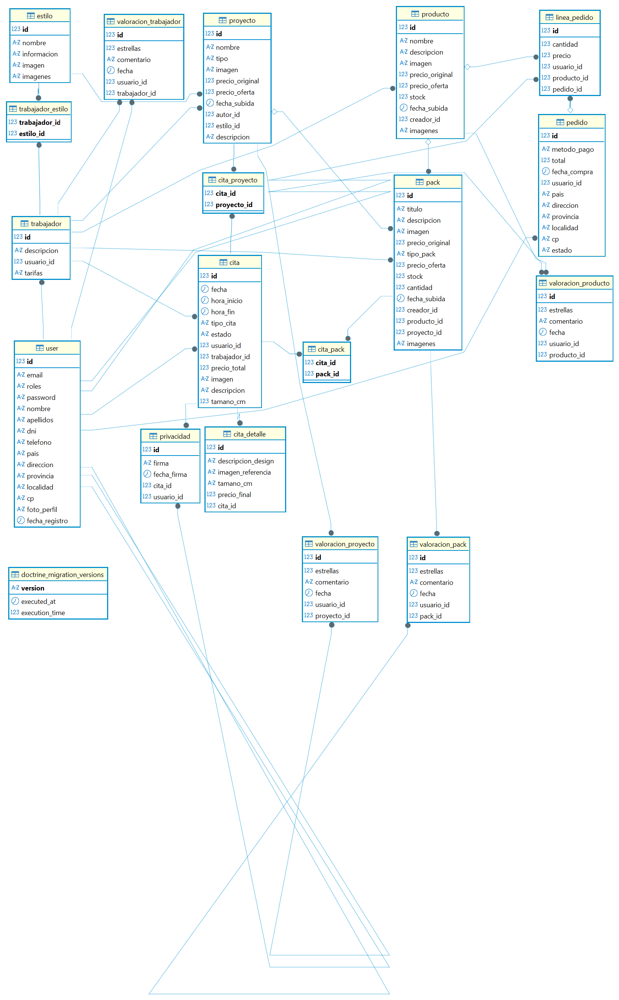

---

## 4. Tablas de la Base de Datos

### 4.1 `user`
| Campo | Tipo | Restricciones |
|---|---|---|
| id | INT | PK, AUTO_INCREMENT |
| email | VARCHAR(180) | UNIQUE, NOT NULL |
| roles | JSON | NOT NULL |
| password | VARCHAR(255) | NOT NULL |
| nombre | VARCHAR(255) | NOT NULL |
| apellidos | VARCHAR(255) | NOT NULL |
| dni | VARCHAR(20) | NOT NULL |
| telefono | VARCHAR(20) | NOT NULL |
| pais | VARCHAR(100) | NOT NULL |
| direccion | VARCHAR(255) | NOT NULL |
| provincia | VARCHAR(100) | NOT NULL |
| localidad | VARCHAR(100) | NOT NULL |
| cp | VARCHAR(10) | NOT NULL |
| foto_perfil | LONGTEXT | NULLABLE |
| fecha_registro | DATETIME | NOT NULL |

### 4.2 `trabajador`
| Campo | Tipo | Restricciones |
|---|---|---|
| id | INT | PK, AUTO_INCREMENT |
| usuario_id | INT | FK → user.id, UNIQUE, NOT NULL |
| descripcion | TEXT | NOT NULL |
| tarifas | JSON | NULLABLE |

### 4.3 `estilo`
| Campo | Tipo | Restricciones |
|---|---|---|
| id | INT | PK, AUTO_INCREMENT |
| nombre | VARCHAR(255) | NOT NULL |
| informacion | TEXT | NOT NULL |
| imagen | TEXT | NOT NULL |
| imagenes | JSON | NULLABLE |

### 4.4 `trabajador_estilo` (tabla pivote M:N)
| Campo | Tipo | Restricciones |
|---|---|---|
| trabajador_id | INT | FK → trabajador.id |
| estilo_id | INT | FK → estilo.id |

### 4.5 `proyecto`
| Campo | Tipo | Restricciones |
|---|---|---|
| id | INT | PK, AUTO_INCREMENT |
| autor_id | INT | FK → trabajador.id, NOT NULL |
| estilo_id | INT | FK → estilo.id, NOT NULL |
| nombre | VARCHAR(255) | NOT NULL |
| tipo | VARCHAR(50) | NOT NULL |
| imagen | LONGTEXT | NOT NULL |
| precio_original | FLOAT | NOT NULL |
| precio_oferta | FLOAT | NULLABLE |
| fecha_subida | DATETIME | NOT NULL |
| descripcion | TEXT | NULLABLE |

### 4.6 `producto`
| Campo | Tipo | Restricciones |
|---|---|---|
| id | INT | PK, AUTO_INCREMENT |
| creador_id | INT | FK → trabajador.id, NOT NULL |
| nombre | VARCHAR(255) | NOT NULL |
| descripcion | TEXT | NOT NULL |
| imagen | TEXT | NOT NULL |
| imagenes | JSON | NULLABLE |
| precio_original | FLOAT | NOT NULL |
| precio_oferta | FLOAT | NULLABLE |
| stock | INT | NOT NULL |
| fecha_subida | DATETIME | NOT NULL |

### 4.7 `pack`
| Campo | Tipo | Restricciones |
|---|---|---|
| id | INT | PK, AUTO_INCREMENT |
| creador_id | INT | FK → trabajador.id, NOT NULL |
| producto_id | INT | FK → producto.id, NULLABLE |
| proyecto_id | INT | FK → proyecto.id, NULLABLE |
| titulo | VARCHAR(255) | NOT NULL |
| descripcion | TEXT | NOT NULL |
| imagen | TEXT | NOT NULL |
| imagenes | JSON | NULLABLE |
| precio_original | FLOAT | NOT NULL |
| tipo_pack | VARCHAR(50) | NOT NULL |
| precio_oferta | FLOAT | NULLABLE |
| stock | INT | NOT NULL |
| cantidad | INT | NOT NULL |
| fecha_subida | DATETIME | NOT NULL |

### 4.8 `cita`
| Campo | Tipo | Restricciones |
|---|---|---|
| id | INT | PK, AUTO_INCREMENT |
| usuario_id | INT | FK → user.id, NOT NULL |
| trabajador_id | INT | FK → trabajador.id, NOT NULL |
| fecha | DATE | NOT NULL |
| hora_inicio | TIME | NOT NULL |
| hora_fin | TIME | NOT NULL |
| tipo_cita | VARCHAR(50) | NOT NULL |
| estado | VARCHAR(50) | NOT NULL |
| precio_total | FLOAT | NULLABLE |
| imagen | VARCHAR(255) | NULLABLE |
| descripcion | TEXT | NULLABLE |
| tamano_cm | INT | NULLABLE |

### 4.9 `cita_detalle`
| Campo | Tipo | Restricciones |
|---|---|---|
| id | INT | PK, AUTO_INCREMENT |
| cita_id | INT | FK → cita.id, UNIQUE, NOT NULL |
| descripcion_design | TEXT | NOT NULL |
| imagen_referencia | VARCHAR(255) | NULLABLE |
| tamano_cm | VARCHAR(50) | NOT NULL |
| precio_final | FLOAT | NOT NULL |

### 4.10 `privacidad`
| Campo | Tipo | Restricciones |
|---|---|---|
| id | INT | PK, AUTO_INCREMENT |
| cita_id | INT | FK → cita.id, UNIQUE, NOT NULL |
| usuario_id | INT | FK → user.id, NOT NULL |
| firma | TEXT | NOT NULL |
| fecha_firma | DATETIME | NOT NULL |

### 4.11 `pedido`
| Campo | Tipo | Restricciones |
|---|---|---|
| id | INT | PK, AUTO_INCREMENT |
| usuario_id | INT | FK → user.id, NOT NULL |
| metodo_pago | VARCHAR(50) | NOT NULL |
| total | FLOAT | NOT NULL |
| fecha_compra | DATETIME | NOT NULL |
| pais | VARCHAR(100) | NOT NULL |
| direccion | VARCHAR(255) | NOT NULL |
| provincia | VARCHAR(100) | NOT NULL |
| localidad | VARCHAR(100) | NOT NULL |
| cp | VARCHAR(20) | NOT NULL |
| estado | VARCHAR(50) | DEFAULT 'Pendiente' |

### 4.12 `linea_pedido`
| Campo | Tipo | Restricciones |
|---|---|---|
| id | INT | PK, AUTO_INCREMENT |
| usuario_id | INT | FK → user.id, NOT NULL |
| producto_id | INT | FK → producto.id, NULLABLE |
| pedido_id | INT | FK → pedido.id, NULLABLE |
| cantidad | INT | NOT NULL |
| precio | FLOAT | NOT NULL |

### 4.13 Tablas de Valoraciones
Se repite la misma estructura para las 4:

**`valoracion_proyecto`**, **`valoracion_producto`**, **`valoracion_pack`**, **`valoracion_trabajador`**

| Campo | Tipo | Restricciones |
|---|---|---|
| id | INT | PK, AUTO_INCREMENT |
| usuario_id | INT | FK → user.id, NOT NULL |
| {entidad}_id | INT | FK → {entidad}.id, NOT NULL |
| estrellas | INT | NOT NULL |
| comentario | TEXT | NOT NULL |
| fecha | DATETIME | NOT NULL |

---

## 5. Roles de Usuario

Hay creados tres roles, estos puedes verlos en `security.yaml`:

| Rol | Hereda de | Descripción |
|---|---|---|
| `ROLE_USER` | — | Rol base. Asignado automáticamente a todos los usuarios registrados. |
| `ROLE_TRABAJADOR` | `ROLE_USER` | Tatuadores/Artistas. Gestionan proyectos, productos, packs y agenda. |
| `ROLE_ADMIN` | `ROLE_USER` | Administrador. Gestión de roles, historial de pedidos, agendas de todos los trabajadores. |

### 5.1 Usuarios de prueba
| Rol | Usuario | Contraseña |
|---|---|---|
| `Administrador` | `admin@gmail.com` | admin |
| `Trabajador` | `law@gmail.com` | 1234 |
| `Cliente` | `maria@gmail.com` | 123 |

---

## 6. Casos de Uso por Rol

### 6.1 Usuario sin cuenta (Visitante)
- Ver la página de inicio
- Navegar por la página de proyectos y ver detalles
- Ver el equipo de tatuadores y sus perfiles
- Explorar estilos de tatuaje disponibles
- Ver catálogo de merchandising y detalle de productos
- Ver ofertas y packs disponibles
- Ver las plantillas más demandadas y proyectos más gustados
- Buscar contenido en la aplicación
- Consultar políticas de privacidad y reembolso
- Registrarse o iniciar sesión

### 6.2 `ROLE_USER` (Usuario Logueado)
*Incluye todo lo anterior, más esto:*
- Iniciar sesión con autenticación (token) JWT y ver/editar su perfil
- **Reservar citas**: seleccionar trabajador, fecha, hora, tipo de cita, plantillas/packs, tamaño y descripción
- **Firmar consentimiento digital**: antes de reservar la cita (Te da la opción de poder firmarlo)
- **Comprar merchandising**: añadir productos al carrito, checkout con dirección de envío
- **Valorar** proyectos, productos, packs y trabajadores (estrellas + comentario)
- Editar y eliminar sus propias valoraciones
- Gestionar favoritos de plantillas

### 6.3 `ROLE_TRABAJADOR` (Trabajador)
*Incluye todo lo de ROLE_USER, más esto:*
- **Gestionar proyectos**: crear, editar y eliminar sus propios tatuajes (plantillas y trabajos realizados)
- **Gestionar productos**: crear, editar y eliminar merchandising
- **Gestionar packs**: crear, editar y eliminar packs (Estos se crean a partir de las proyectos y productos que hayan en la web)
- **Gestionar estilos**: crear y editar estilos de tatuajes
- **Agenda personal**: ver calendario mensual con citas, acceder a vista detallada por día, gestionar estados de citas (pendiente, confirmada, completada, cancelada)

### 6.4 `ROLE_ADMIN` (Administrador)
*Incluye todo lo de ROLE_TRABAJADOR, más esto:*
- **Gestión de roles**: promover/degradar usuarios entre ROLE_USER, ROLE_TRABAJADOR y ROLE_ADMIN
- **Vista de agendas**: ver la lista de todos los trabajadores y acceder a la agenda de cualquiera
- **Historial completo**: consultar todos los pedidos del sistema, cambiar estados (Pendiente, Enviado, Entregado, Devuelto)

---

## 7. Dockerización y Despliegue

### 7.1 Entorno Local con Docker Compose

El archivo `docker-compose.yml` tiene 4 servicios:

| Servicio | Puerto |
|---|---|
| `frontend` | `80` |
| `backend` | `8000` |
| `db` | `3306` |
| `phpmyadmin` | `8080` |

```bash
# Levantar todo el entorno local
docker-compose up --build
```

### 7.2 Despliegue

#### Frontend → Vercel

Configurado en `vercel.json`:
- **Install**: `npm install --prefix frontend`
- **Build**: `npm run build --prefix frontend` (Vite genera `frontend/dist`)
- **Output**: `frontend/dist`
- **Rewrites**: Todas las rutas se redirigen a `index.html` (SPA con React Router)
- La variable de entorno `VITE_API_URL` apunta al backend de Railway

#### Backend + BD → Railway

Configurado en `railway.json`:
- **Builder**: Dockerfile (`docker/backend/Dockerfile`)
- **Restart policy**: `ON_FAILURE` con 10 reintentos máximos

**Dockerfile del backend** (multi-paso):
1. Parte de `php:8.2-apache`
2. Instala extensiones: `pdo_mysql`, `intl`, `zip`
3. Habilita `mod_rewrite` y configura `DocumentRoot` → `/var/www/symfony/public`
4. Configura `SetEnvIf Authorization` para pasar el JWT a PHP
5. Instala dependencias con Composer
6. Genera claves JWT si no existen
7. Optimiza autoload y warmup de caché de producción
8. Script de inicio dinámico que adapta el puerto al proporcionado por Railway (`$PORT`)

**Base de datos**: MySQL 8.0 gestionada por Railway.

### 7.3 CORS en Producción

Configurado en `nelmio_cors.yaml` con `origin_regex: true`:
```
CORS_ALLOW_ORIGIN='^https?://(localhost|127\.0\.0\.1)(:[0-9]+)?$|^https://tfg-tattoos.*\.vercel\.app$'
```
Permite peticiones desde localhost (desarrollo) y cualquier subdominio de Vercel (producción/previews).

### 7.4 Autenticación JWT

- **LexikJWTAuthenticationBundle** genera tokens firmados con RSA (claves PEM)
- El frontend almacena el token en `localStorage` y lo envía en la cabecera `Authorization: Bearer {token}`
- Un interceptor de Axios comprueba la expiración del token antes de cada petición
- Apache requiere la directiva `SetEnvIf` para pasar la cabecera `Authorization` a PHP

---

## 8. Estructura del Proyecto

```
TFG_DEF/
├── frontend/                    
│   ├── src/
│   │   ├── components/   
│   │   ├── context/      
│   │   ├── hooks/        
│   │   ├── pages/        
│   │   ├── services/     
│   │   ├── types/        
│   │   ├── utils/        
│   │   └── App.tsx       
│   └── package.json
│
├── backend/   
│   ├── config/
│   │   └── packages/             
│   ├── src/
│   │   ├── Controller/       
│   │   ├── Entity/   
│   │   ├── EventListener/        
│   │   ├── Repository/     
│   │   ├── Security/   
│   │   └── State/   
│   └── composer.json
│
├── docker/
│   ├── backend/Dockerfile
│   ├── db/data/   
│   └── frontend/
│      ├── Dockerfile    
│      └── nginx.conf    
| 
│
├── docker-compose.yml    
├── railway.json          
└── vercel.json           
```

---

## 9. Endpoints Principales de la API

| Método | Endpoint | Acceso | Descripción |
|---|---|---|---|
| POST | `/api/login_check` | Público | Autenticación (JWT) |
| GET | `/api/me` | Autenticado | Datos del usuario |
| POST | `/api/users` | Público | Registro de usuarios |
| GET | `/api/proyectos` | Público | Mostrar proyectos |
| POST | `/api/proyectos` | Trabajador/Admin | Crear proyecto |
| GET | `/api/productos` | Público | Mostrar productos |
| POST | `/api/productos` | Trabajador/Admin | Crear productos |
| GET | `/api/packs` | Público | Mostrar packs |
| POST | `/api/packs` | Trabajador/Admin | Crear packs |
| GET | `/api/trabajadors` | Público | Mostrar trabajadores |
| GET | `/api/estilos` | Público | Mostrar estilos |
| POST | `/api/estilos` | Trabajador/Admin | Crear estilos |
| GET | `/api/citas` | Autenticado | Mostrar citas |
| POST | `/api/citas` | Autenticado | Reservar cita |
| POST | `/api/checkout` | Autenticado | Procesar pedido |
| GET | `/api/valoracion_*` | Público/Autenticado | Valoraciones de proyectos, productos, packs y trabajadores |
| POST | `/api/valoracion_*` | Autenticado | Valoraciones de proyectos, productos, packs y trabajadores |
| GET | `/api/equipo` | Público | Miembros del equipo |

---

## 10. Explicación web


### 10.1 Página de Inicio

#### Cosas en común en todos los inicios

Todos los inicios tienen lo siguiente en común:
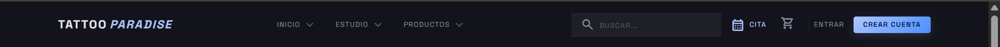

```
- Inicio --> Este te lleva al home de la página y en el desplegable tiene un botón "Contacto", este botón te lleva directamente al apartado de contacto.

- Estudio --> Este campo de aquí te abre un desplegable con las siguientes opciones:

        - Equipo --> Te muestra todos los trabajadores.

        - Estilos --> Te muestra todos los estilos disponibles.

        - Proyectos --> Te muestra todos los proyectos de los trabajadores.

        - Proyectos Demandados --> Te muestra los proyectos más solicitados.

        - Proyectos más gustados --> Te muestra los proyectos con la mejor valoración.

- Productos --> En el desplegable de este campo, aparece las siguientes opciones:

        - Merchandising --> Productos que se venden.

        - Packs y Ofertas --> Packs, packs en oferta y productos/proyectos en oferta.

- Búsqueda --> Para buscar proyectos, productos y packs.

- Carrito --> Para hacer la compra.

- Perfil --> Si mantienes el ratón encima del icono del perfil te aparecen dos opciones: "Ver perfil" y "Cerrar sesión".

```

Si por ejemplo no has iniciado sesión te aparecerá "Entrar" y "Crear Cuenta".
```
- Entrar --> Iniciar sesión

- Crear Cuenta --> Registrarse
``` 

Más abajo, tendrán un mapa interactivo de google maps y un apartado llamado "Información del Local", este contiene información sobre el sitio, los contactos del sitio y la ubicación, las políticas de privacidad y reembolso y también un botón "Ver equipo" que si pulsas en él, te lleva a la vista Equipo.

```
- Políticas de privacidad --> En su vista aparece un simple texto de las políticas.

- Política de reembolso --> Básicamente lo mismo que políticas de privacidad pero orientadas al reembolso.
```

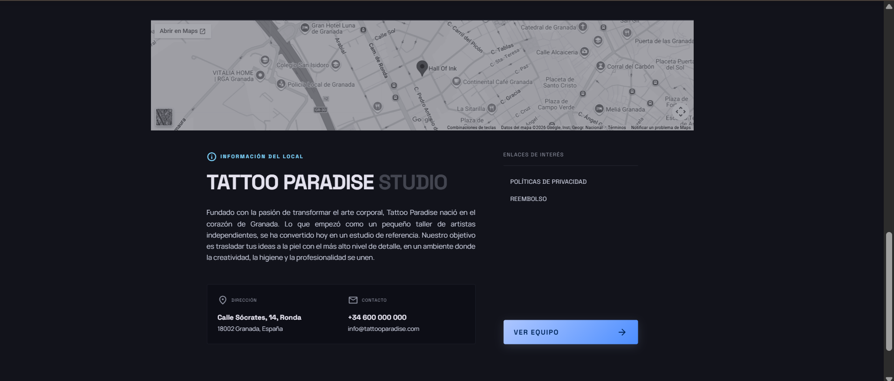

`Vista Usuario:`
La vista del Inicio del usuario, es literalmente como la explicación de antes, pero el icono de citas te lleva a para relizar una cita/reserva.

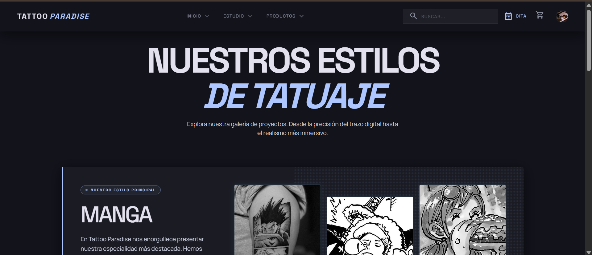

`Vista Trabajador:`
La vista del Inicio del trabajador: el trabajador tiene un apartado más que es el de herramientas y el icono para las citas en vez de llevarte a reservar cita, te lleva a la agenda del trabajador.

```
- Herramientas --> En este desplegable se nos muestra las diferentes opciones:

        - Añadir Estilo --> Añadir un nuevo estilo.

        - Añadir Tatuaje --> Añadir un nuevo proyecto.

        - Añadir producto --> Añadir un nuevo producto.

        - Crear Pack --> Añadir un nuevo pack.
```

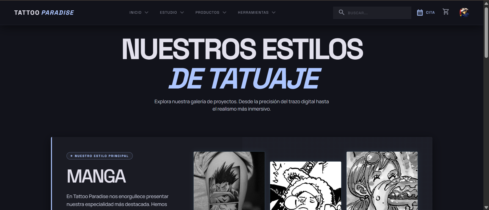


`Vista Administrador:`
La vista del Inicio del administrador: el administrador tiene lo mismo que el trabajador, pero se le añade un desplegable nuevo, el de Gestión y el icono para las citas en vez de llevarte a reservar cita, te lleva a una vista donde aparecen todos los trabajadores y en el que pulses, te mostrará la agenda de dicho trabajador.

```
- Gestión --> En este desplegable se nos muestra las diferentes opciones:

        - Historial --> Todos los pedidos que se han hecho.

        - Gestionar Roles --> Cambiar roles.
```

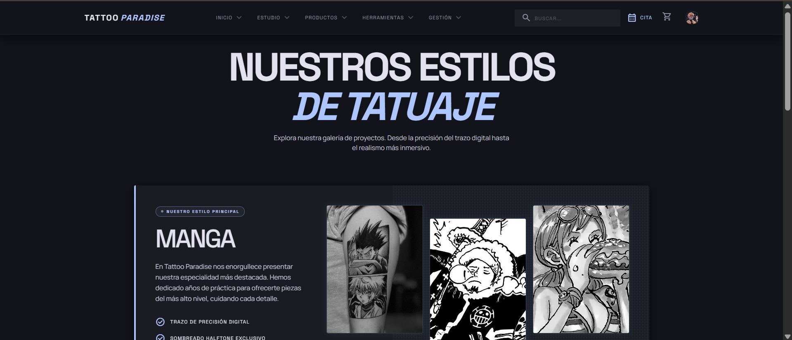

### 10.2 Perfil

### Cosas en común en todos los perfiles
En estas vistas aparecen unos apartados para poder modificar el correo, la foto de perfil, la contraseña y el teléfono. También tienen unos botones para poder eliminar la cuenta y cerrar sesión, aparte de eso, también tienen un apartado que es para ver los pedidos que haya realizado, y una vez que le llegue el paquete este ya desaparece (Por defecto le he puesto que tarde tres días que es lo que se tarda más o menos con las entregas de los paquetes).

Vista de los pedidos:

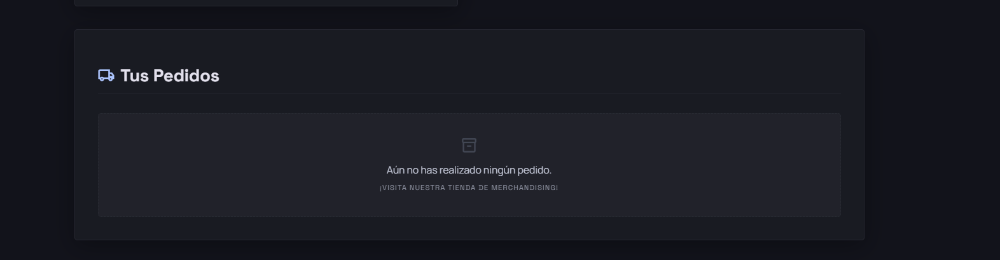

`Vista Usuario:`
La vista del Perfil del usuario, tiene un apartado donde le aparecen las citas y en el estado en el que se encuentran, si una cita es cancelada, este tiene la opción de poder borrarla de su perfil para limpiar espacio. 

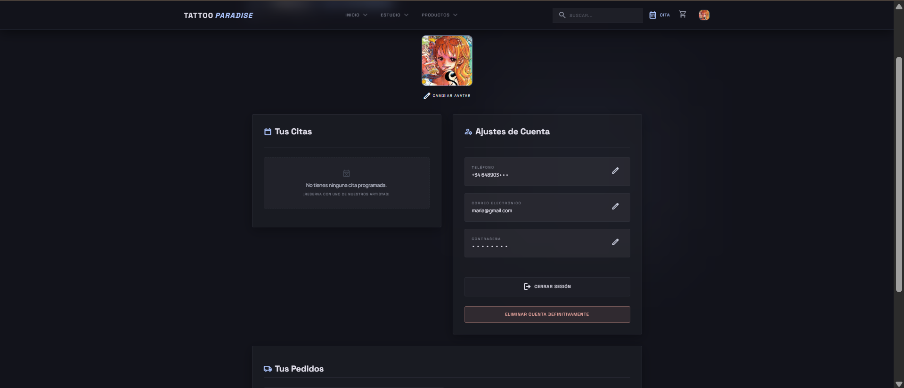


`Vista Trabajador:`
La vista de Perfil del trabajador, en esta vista aparecen los siguientes campos:
``` 
- Especializaciones --> Elegir en que estilos está especializado. (Solamente puede poner las que existen en la vista de estilos)

- Biografía/Descripción --> Una breve explicación de sobre quién es y que cosas puede hacer (Si este campo no lo rellena no aparecerá en el apartado de Equipo).

- Gestionar tu agenda --> Te muestra los días del mes que te encuentras y así poder ver que citas tienes para cada día.

- Tarifas y tiempos de trabajo --> Tiempo que tarda en hacer un tatuaje en base a los centímetros, los centímetros y el precio.
```

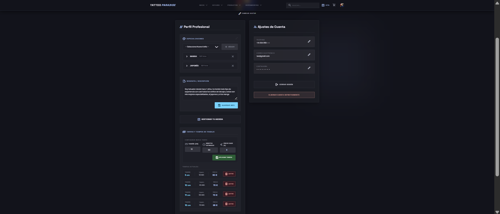


`Vista Administrador:`
La vista de Perfil del administrador, en esta vista aparecen los siguientes campos:
``` 
- Historial/Base de datos --> Todos los pedidos que se han realizado.

- Gestión de roles --> Gestionar roles.

- Agenda Global --> Las agendas de todos los trabajadores.
```

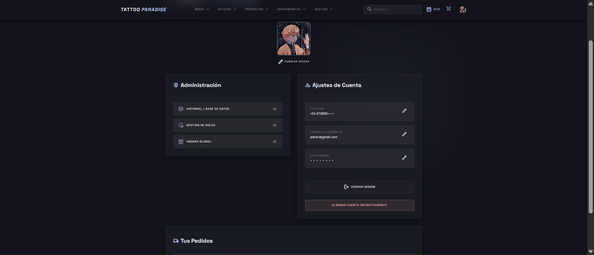


### 10.3 Proyectos

En esta vista, se podrán ver todos los proyectos que hayan sido creados, en cada proyecto se muestra la imagen, el nombre, el autor, el estilo, el precio, una descripción, una valoración media y una opción para guardar esos proyectos en favoritos. También se puede ver que hay una opción para poder hacer filtrados

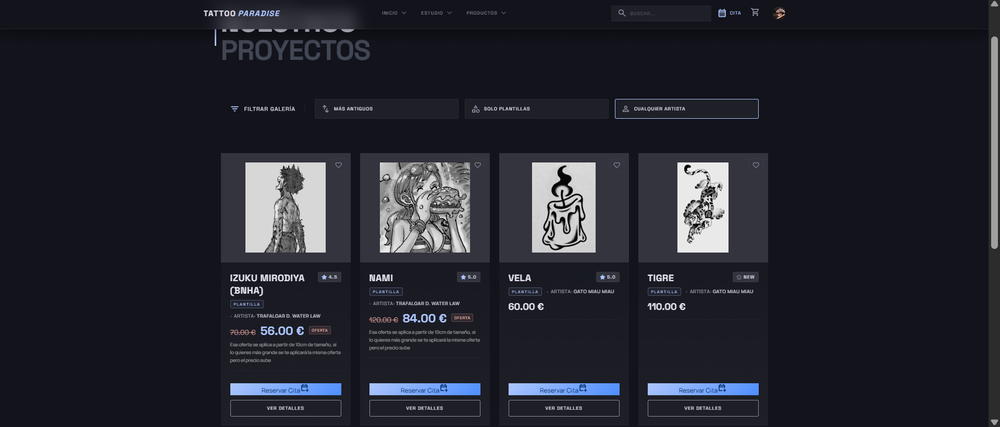

`Opción Favoritos:`
Solamente puedes poner en favoritos las plantillas, para poder hacer esta acción, tienes que pulsar en el corazón que aparece arriba en la derecha de la card. Cuando el corazón está de color rojo significa que está guardado en favorito.

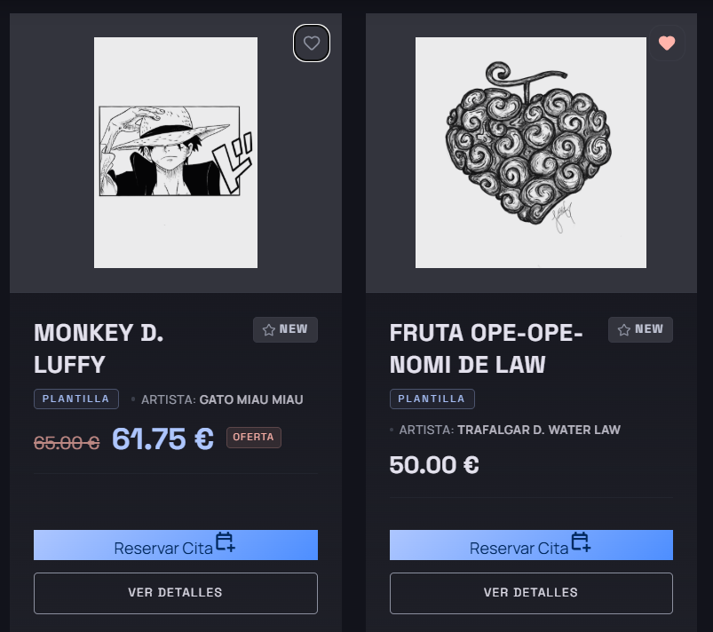

En cambio, para la vista trabajador y administrador se ve distinto porque a estos les aparece la opción de poder editar o eliminar un proyecto y la opción de reservar cita se les elimina. Pero ojo, el trabajador, solamente puede editar y eliminar los proyectos que haya hecho él y el administrador puede con todos los proyectos.

Ejemplo:

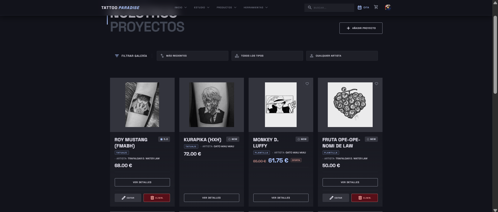

### 10.4 Detalle de Proyecto

Vista completa del diseño más detallada y con la sección de valoraciones y comentarios.

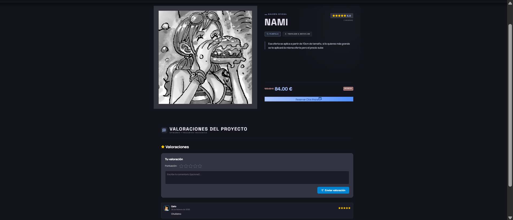

### 10.5 Equipo
Te muestra todos los trabajadores con su foto, nombre, descripción y en que esta especializado. (A parte de eso también hay para poder filtrar)

 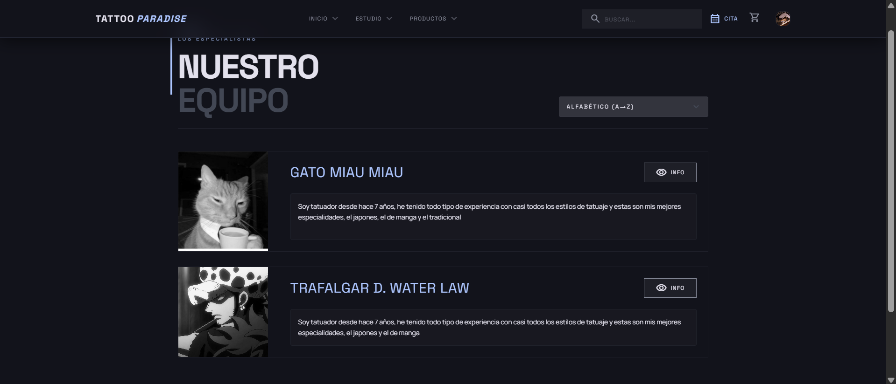

Te muestra más a detalle la información del trabajador. Te muestra la información anterior, pero sumandole su email, número de teléfono, para pedir cita, los proyectos que ha creado y al lado un filtro para poder filtrar, una media de valoraciones y un apartado de valoraciones y comentarios.

 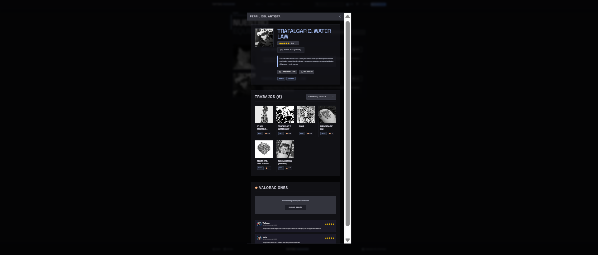

### 10.6 Estilos de Tatuaje

Catálogo de estilos (Ej: realismo, tradicional, blackwork...) con imágenes de ejemplo y también información sobre dicho estilo.

 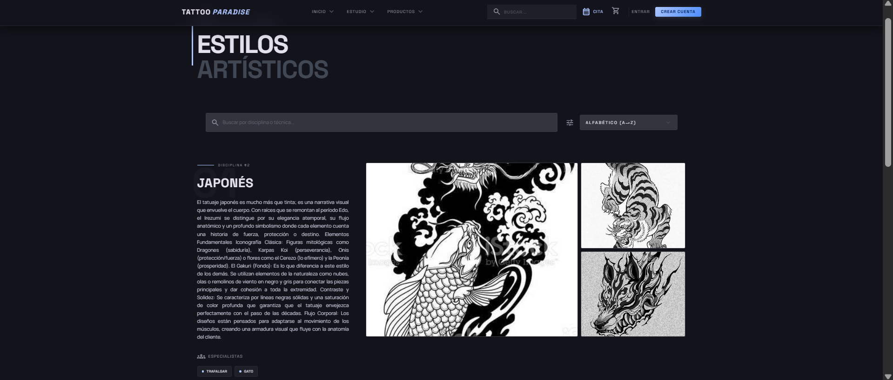 

Pero para la vista trabajador y administrador aparecerán los botones de editar y eliminar.

Ejemplo: 

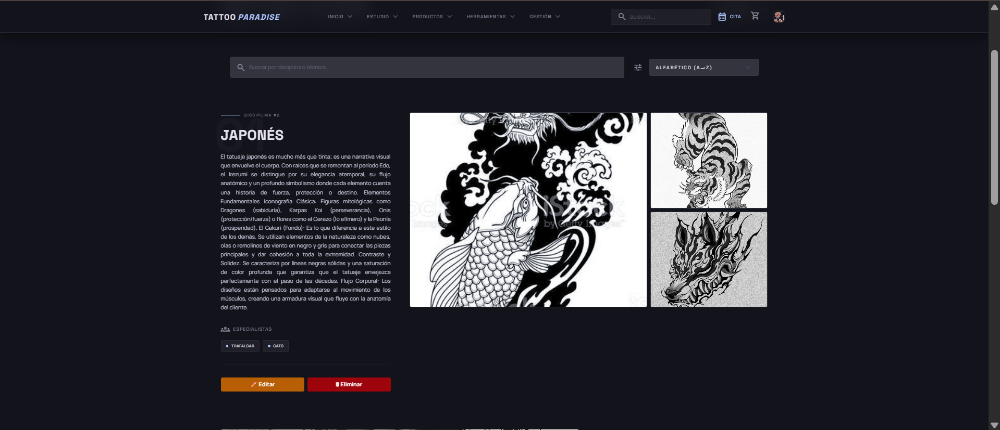

### 10.7 Merchandising
En esta vista te aparecerán todos los productos disponibles y en cada tarjeta aparecerá con precios, stock, descripción, detalles y carrito de compras.

 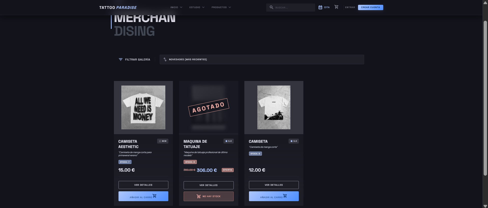 

Pero para la vista de trabajador o administrador, aparecen los botones de editar o eliminar.

Ejemplo:

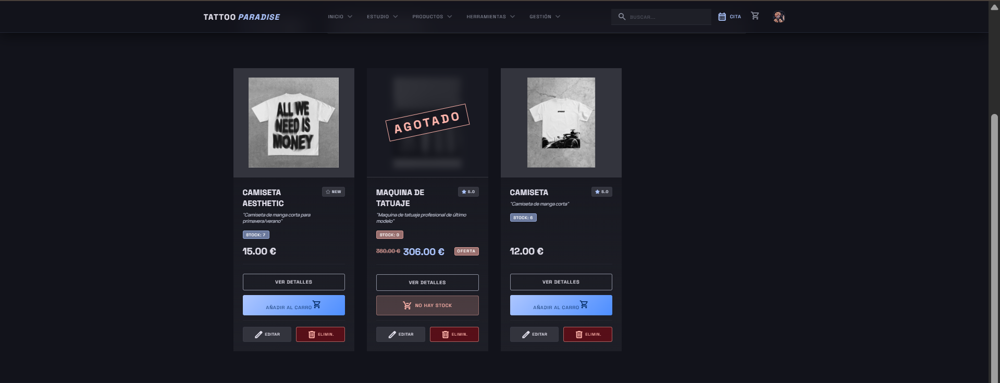

### 10.8 Detalle de Producto
Vista completa del diseño más detallada y con la sección de valoraciones y comentarios.

 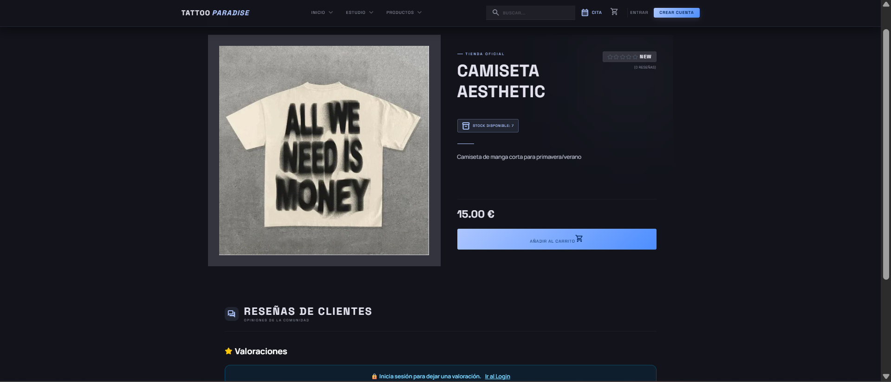 

### 10.9 Packs y Ofertas
Vista de packs y ofertas con packs de productos, plantillas o servicios y productos y plantillas o packs en oferta, en cada tarjeta que sea de pack (que lo indica) te aparecerá un stock, un precio, una descripción, un añadir a la cesta, un detalles y un oferta si este tiene oferta. A parte de eso te aparecen las tarjetas de productos y de proyectos con la etiqueta de oferta (solamente esos). También hay un filtrado en el que puedes filtrar por plantillas, productos o servicios (tatuajes) y también puedes filtrar para elegir si quieres que te aparezcan solamente packs o solamente ofertas o ambas.

 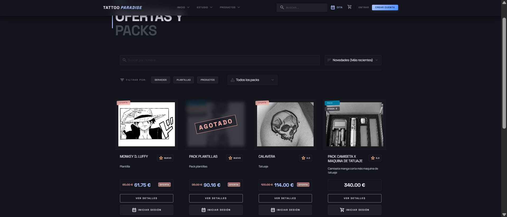

Con la vista trabajador y administrador vuelven a aparecer los botones de editar y de eliminar.

Ejemplo:

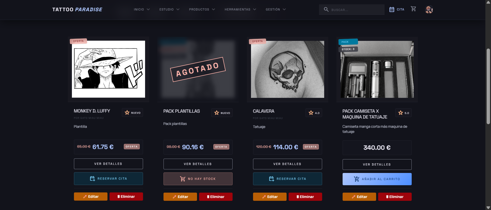

### 10.10 Detalle de Packs y Ofertas
Vista completa del diseño más detallada y con la sección de valoraciones y comentarios.

 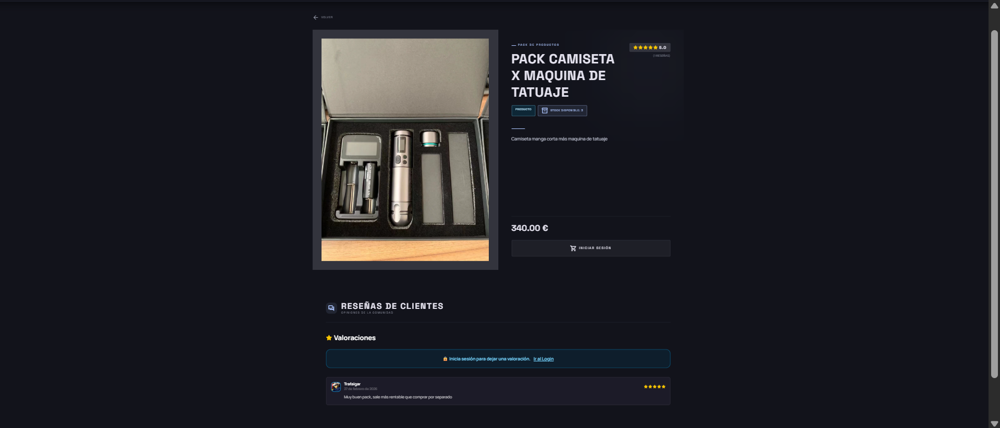

### 10.11 Login
Te aparecen los campos de email y contraseña para rellenarlos con tus datos si tienes ya una cuenta. También en la contraseña cuenta con un botón que puede mostrar o ocultar la contraseña.

 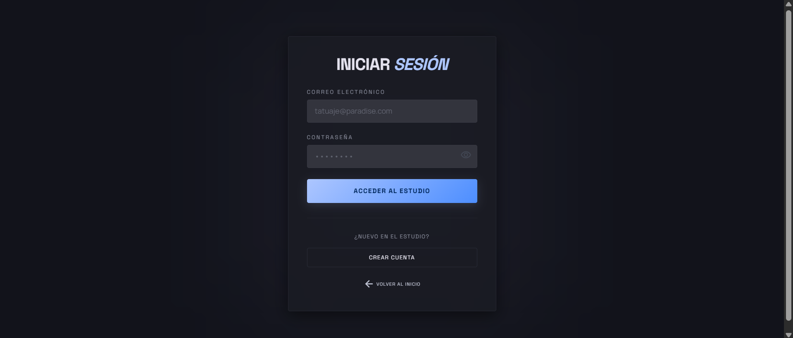

### 10.12 Registro
Te aparecen una sección de diversos campos los cuáles se tienen que rellenar de forma obligatoria.

 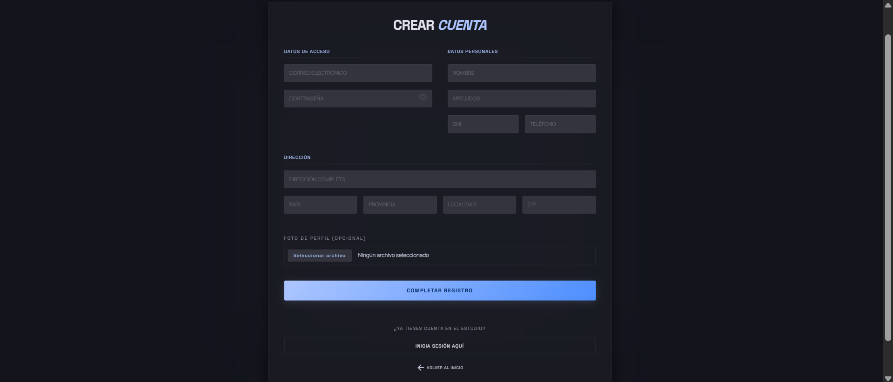 

### 10.13 Reservar Cita
Eliges con que tatuador quieres trabajar.

 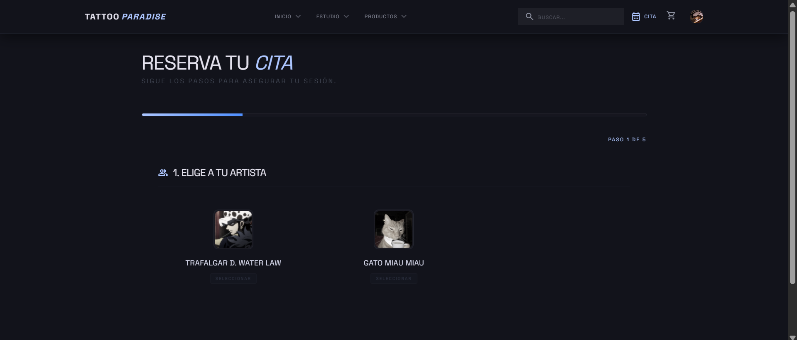

### 10.14 Detalles Tatuaje Reservar Cita
Tienes que elegir que tipo de cita prefieres, si personalizado o del catálogo.

 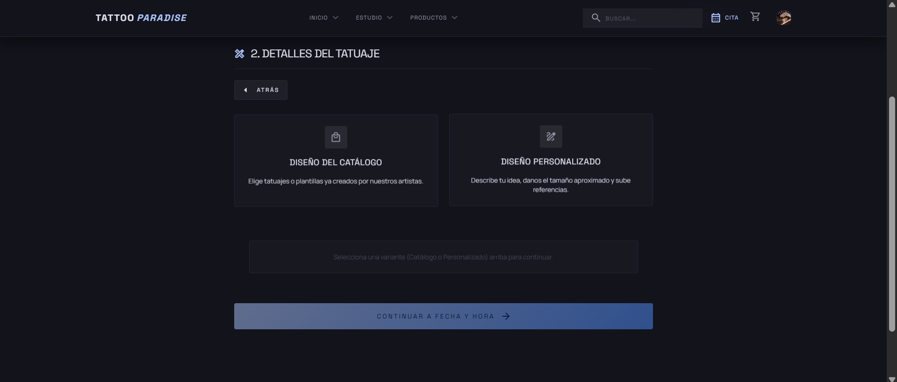

#### 10.14.1 Diseño del Catálogo
Puedes seleccionar las plantillas que tú quieras y después escribir el tamaño que quieres. Si por ejemplo reservas cita desde alguna tarjeta, te aparecerá arriba de todas las plantillas la plantilla que has seleccionado anteriormente.

 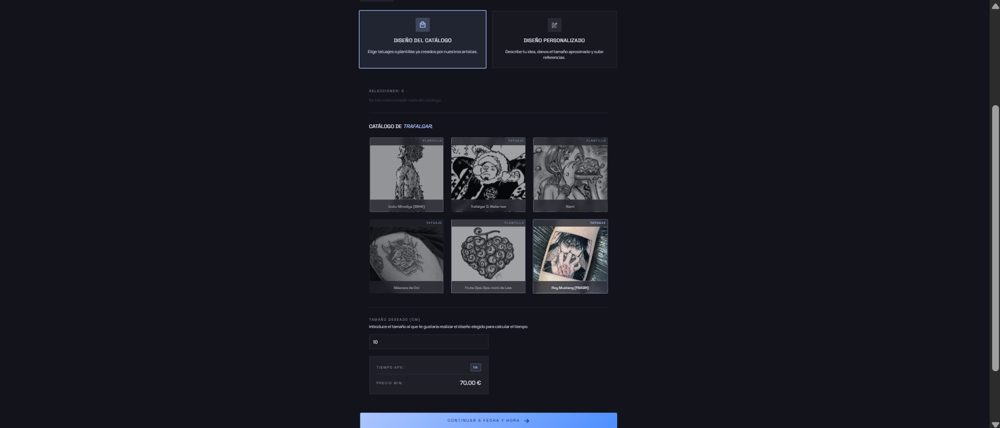

#### 10.14.2 Diseño personalizado
En la descripción tienes que escribir una explicación de sobre cómo quieres el tatuaje, más abajo tendrás la opción de poner una imagen de referencia (esta es opcional) y también podrás escribir el tamaño que desees.

 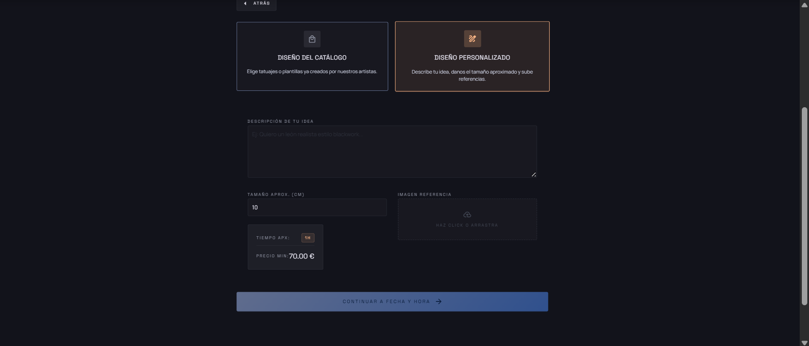

### 10.15 Fecha para Reservar Cita
Eliges la fecha y la hora que quieras para la reserva.

 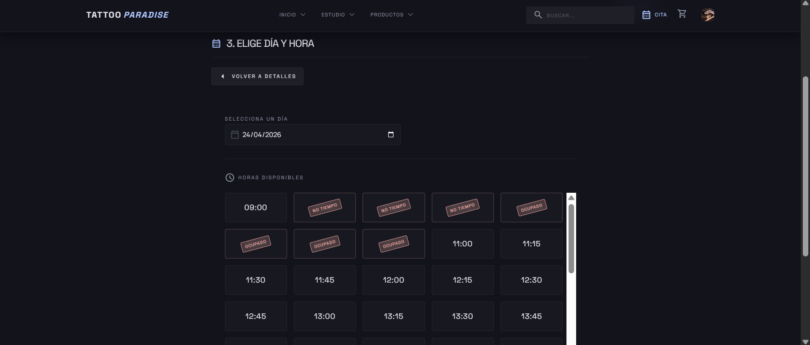

### 10.16 Datos Personales para Reservar Cita
Te mostrarán los datos del usuario ya rellenos en cada campo (el usuario puede editar la información si quiere).

 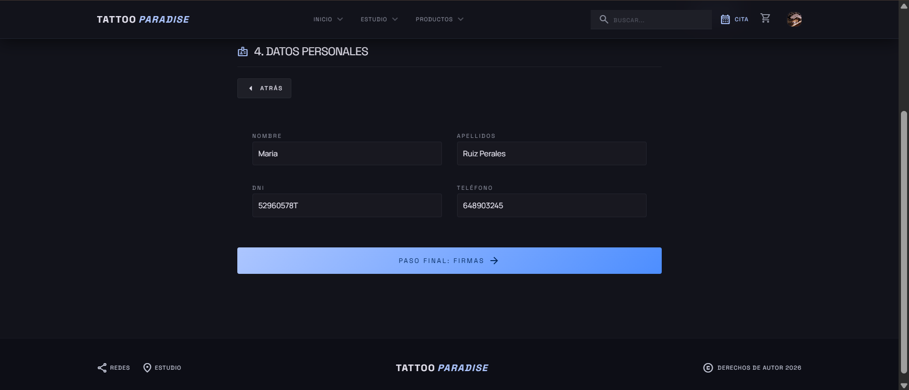

### 10.17 Firma para Reservar Cita

#### 10.17.1 Firma Diseño del Catálogo
Te aparecerá un PDF para una firma de consentimiento digital, si no te descargas este documento y no marcas la casilla de que te comprometes a entregar este documento, no te dejará terminar la reserva. (La firma es opcional)

 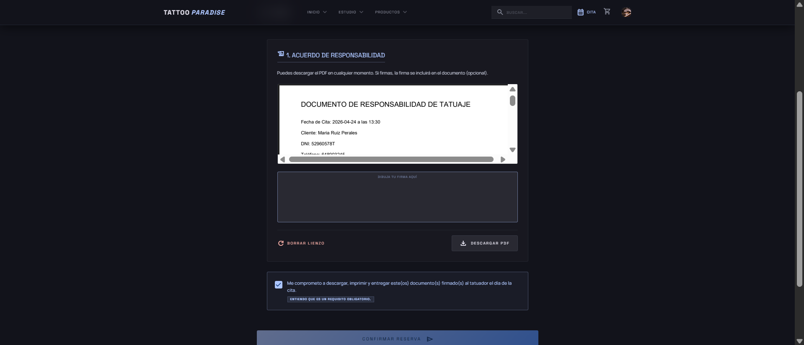

#### 10.17.2 Firma Diseño personalizado
Te aparecerá un PDF para una firma de consentimiento digital y uno de derechos de autor, si no te descargas estos documentos y no marcas la casilla de que te comprometes a entregar ambos documentos, no te dejará terminar la reserva. (La firma es opcional)

 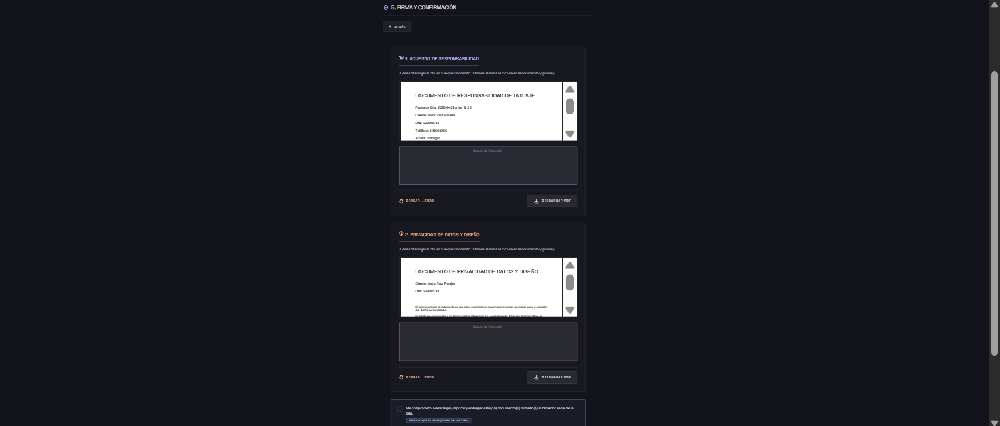

### 10.18 Agenda del Trabajador
Calendario mensual e indica el día en el que te encuentras en ese momento. En la Vista detallada del día, te encontrarás todas las citas que hay reservadas en dicho día con franjas horarias y estados de citas para que el trabajador pueda aceptarlas o rechazarlas.

 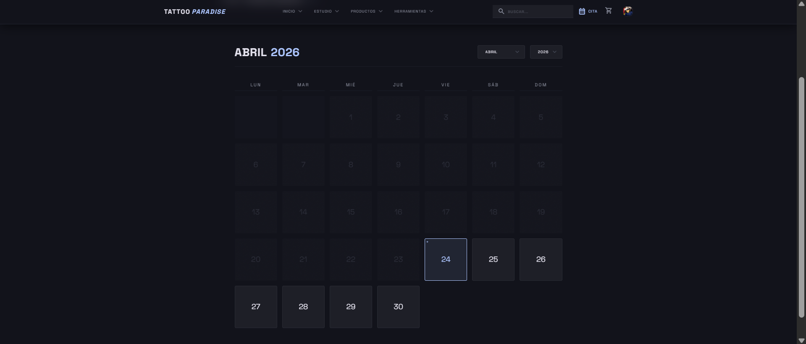

### 10.19 Detalles Agenda del Trabajador
Como se ha dicho antes, en esta vista puedes ver las franjas horarias para cada tatuajes, la gestión del estado.
Pero además este puede modificar el día y las horas de la reserva.

 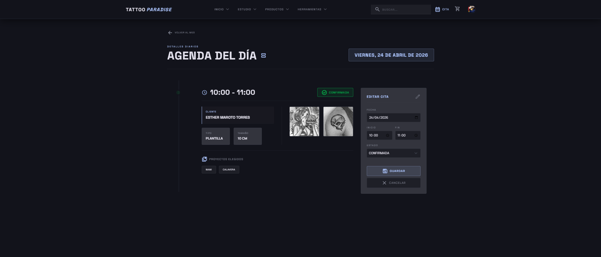

### 10.20 Panel de Administración

#### 10.20.1 Gestión de roles de usuarios
Te muestra todos los usuarios que hay creados en la web con su respectivo nombre, correo y DNI. Al lado de ellos aparece un desplegable y tiene tres opciones: "Administrador", "Trabajador" y "Cliente". (Según lo que se elija a ese usuario se le otorga unos permisos u otros)

También este tiene un buscador para poder buscar directamente al cliente por su nombre y también tiene un filtrado para poder filtrar solamente por "Administradores", "Trabajadores" o "Clientes".

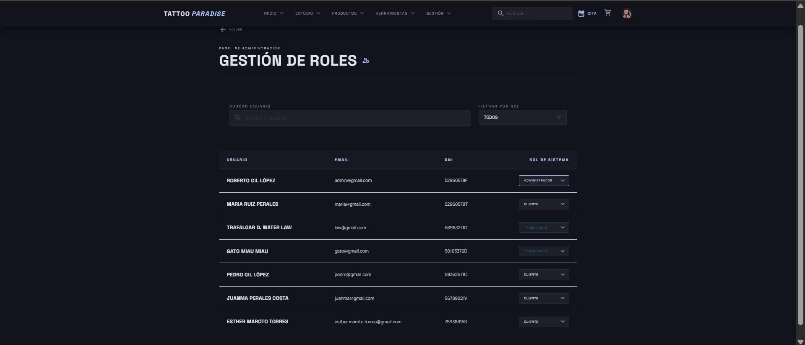

#### 10.20.2 Historial completo de pedidos
Te muestra todas las compras que se han realizado y en cada una de ellas, aparecerá el número del pedido, la fecha de la compra, el nombre del usuario, el precio y al lado te aparecera un desplegable llamado "completado" el cuál si pulsas en él, te dará más detalles de ese pedido. También tiene un buscador y un filtrado por "Administrador", "Trabajador" y "Cliente".

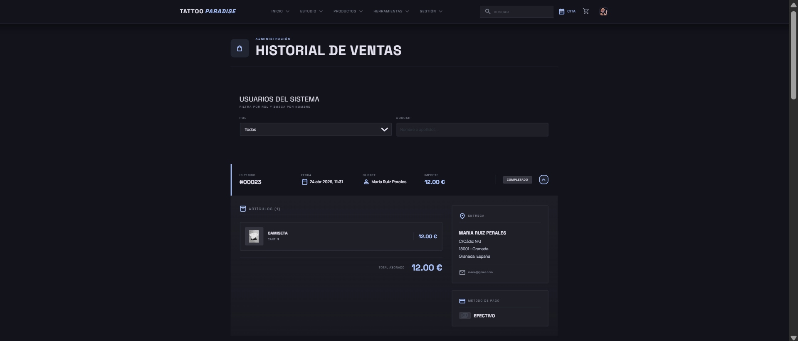

#### 10.20.3 Agendas de todos los trabajadores.
Aparecen todos los trabajadores existentes, cuando pulsas en uno de ellos, te abrirá la agenda de dicho trabajador y dentro de la agenda puedes tú tambien hacer lo que hace un trabajador (Gestionar las citas).

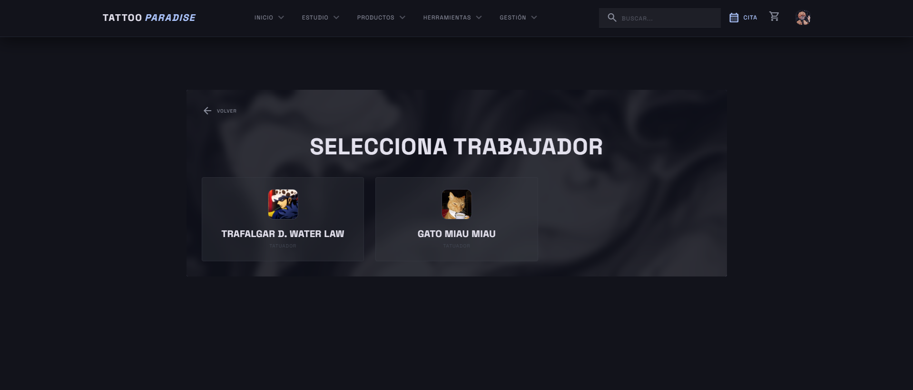

Ejemplo de dos agendas distintas:

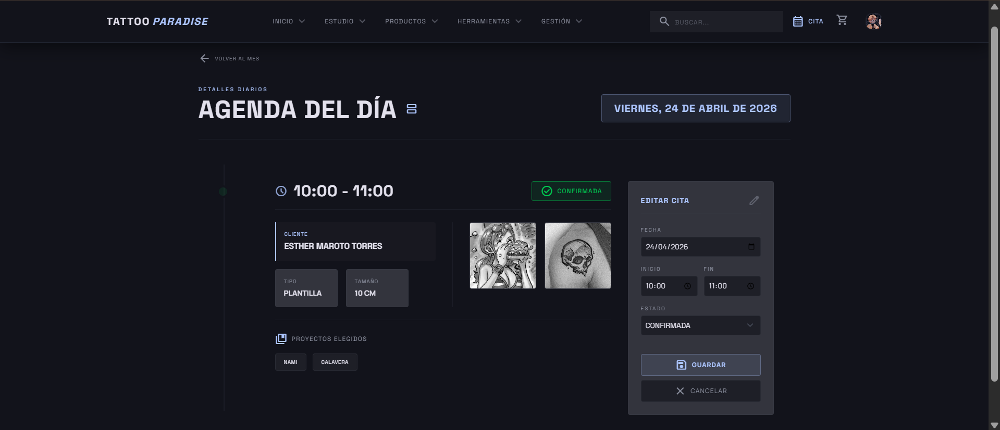
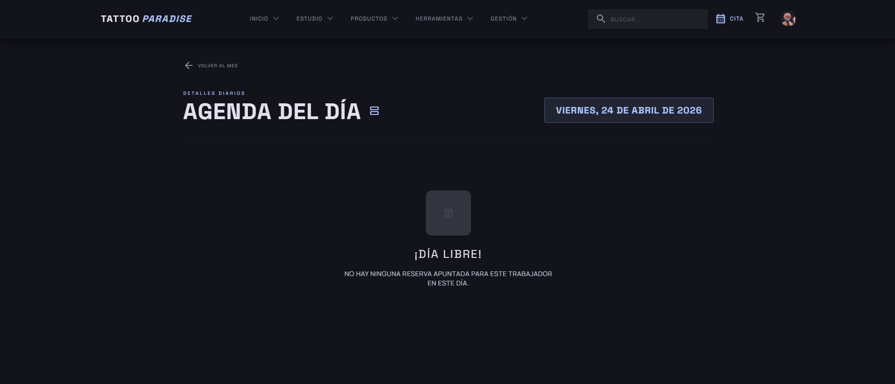

### 10.21 Añadir Estilos

En esta vista, te aparecerán unos campos a rellenar.

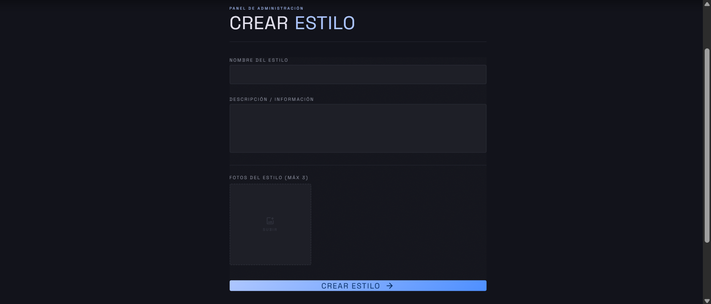

```
- Nombre --> Título que va a tener.

- Descripción --> Explicación sobre dicho estilo.

- Imágenes --> Puedes colocar hasta un máximo de tres imágenes.
```

### 10.22 Añadir Tatuaje

En esta vista, te aparecerán unos campos a rellenar.

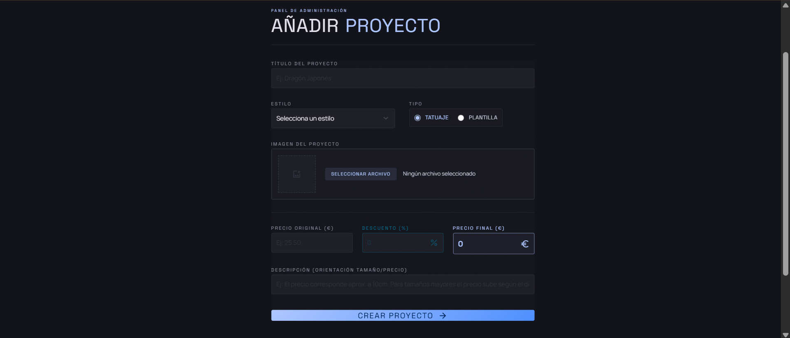

```
- Título --> El título que va a tener.

- Estilo --> Es un desplegable que muestra los estilos que estén creados y solamente podrás elegir uno de esos.

- Tipo --> Es para decir de que tipo es el proyecto, si "Tatuaje" o "Plantilla".

- Imagen --> Para la imagen.

- Precio Original --> El precio base.

- Descuento --> Se ecribe en porcentaje y este es opcional.

- Precio Final --> Es el precio que se termina mostrando.

- Descripción --> Es para la orientación de la relación del tamaño/precio.
```

### 10.23 Añadir Producto

En esta vista, te aparecerán unos campos a rellenar.

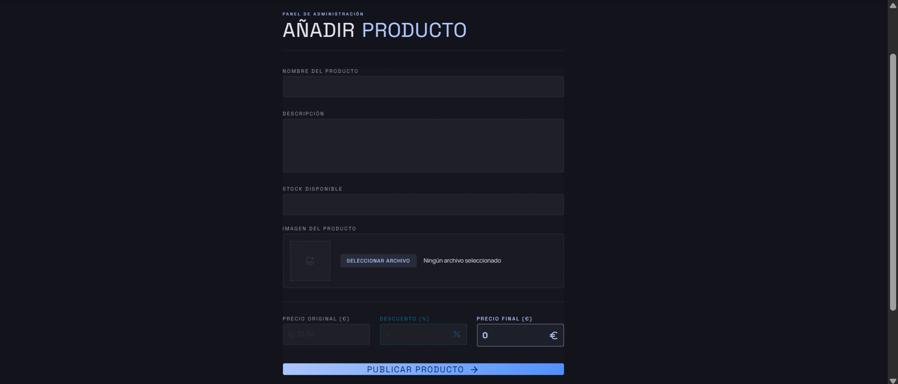

```
- Nombre --> El título que va a tener.

- Descripción --> Explicación sobre el artículo.

- Stock --> Cantidad disponible.

- Imagen --> Para la imagen.

- Precio Original --> El precio base.

- Descuento --> Se escribe en porcentaje y este es opcional.

- Precio Final --> Es el precio que se termina mostrando.
```

### 10.24 Crear Pack

En esta vista, te aparecerán unos campos a rellenar.

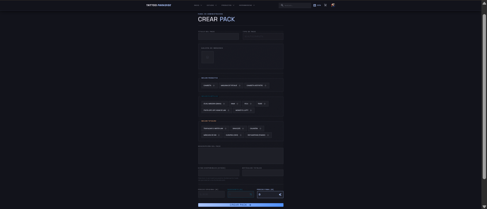

```
- Título --> Título que va a tener.

- Tipo Pack --> Se autocompleta según lo que incluya en el pack.

- Imagen --> Para la imagen (Se pone automáticamente).

- Incluir Productos --> Te aparecen todos los productos disponibles. (Determina el Tipo de pack).

- Incluir Plantillas --> Te aparecen todas las plantillas disponibles. (Determina el Tipo de pack).

- Incluir Tatuajes --> Te aparecen todos los tatuajes disponibles. (Determina el Tipo de pack).

- Descripción --> Explicación sobre el pack.

- Stock --> Cantidad disponible.

- Artículos Totales --> La cantidad de artículos que vienen dentro del pack.

- Precio Original --> El precio base

- Descuento --> Se escribe en porcentaje y este es opcional

- Precio Final --> Es el precio que se termina mostrando
```
>*No se pueden mezclar en el pack ni los productos con las plantillas o tatuajes, ni las plantillas con tatuajes o productos y ni los tatuajes con plantillas o productos.*

### 10.25 Agotados / Sold Out

En las vista de Merchandising y Packs y ofertas hay algunas que aparecen agotadas.

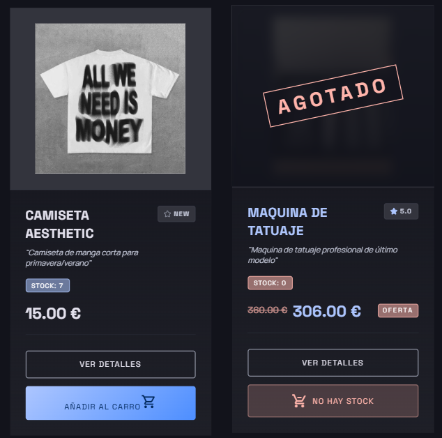

Como puedes ver en esta tarjeta que es de un producto, hay algunos cambios comparado con la otra tarjeta. Por ejemplo vemos que en el recuadro de la imagen lo tapa un texto con la palabra agotado y el fondo lo difumina de un color negro, te pone que el stock es 0 y el botón de añadir al carrito te cambia el texto a "No hay stock", te cambia de color azul a color rojo y tampoco te deja interaccionar con él.

Esto también se aplica en la vista de los detalles del producto, pongo un ejemplo aquí abajo.

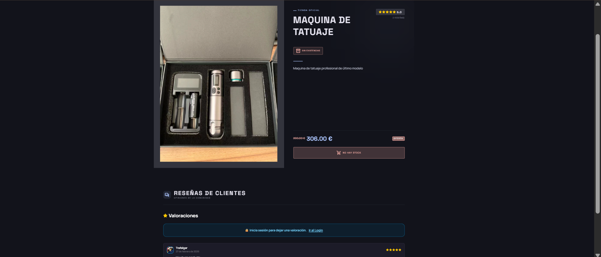

> *Anotación: En los packs es lo mismo*

### 10.26 Buscador

En la vista del buscador, este se divide en tres partes: "Productos", "Proyectos" y "Packs".

Según lo que busques, te devolverá una cosa u otra.

Ejemplo:

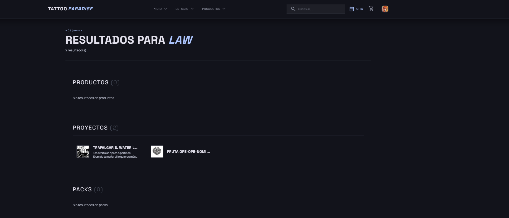

>*Si pulsas en el resultado que te da, te lleva a la vista de los detalles de ese producto, proyecto o pack*

### 10.27 Carrito

En esta vista te aparece los productos que hayas metido al carrito, el poder añadir más veces un mismo artículo o quitar, quitar directamente el artículo del carrito, el precio total de lo que llevas de compra y un botón "Procesar pago" para terminar la compra.

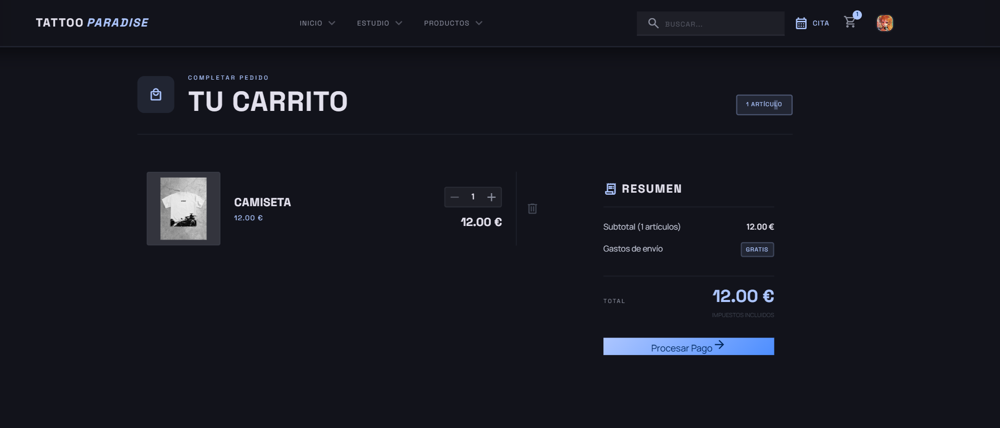

### 10.28 Finalizar Compra

En esta vista te aparecerán unos campos a rellenar como la dirección de donde vives, la localidad, la provincia, el país y el código postal. Aparte de eso te aparece al lado un resumen de lo que estás comprando y más abajo diversos métodos de pago: "Tarjeta", "Bizum" o "Efectivo"

Si eliges como método de pago la "Tarjeta" o el "Bizum", tienes que rellenar los campos necesarios, si por ejemplo eliges efectivo, no tienes que rellenar ningún campo más.

Una vez que hayas elegido el método, ya te dejará poder darle al botón "Finalizar Pedido" y completar con el pago.

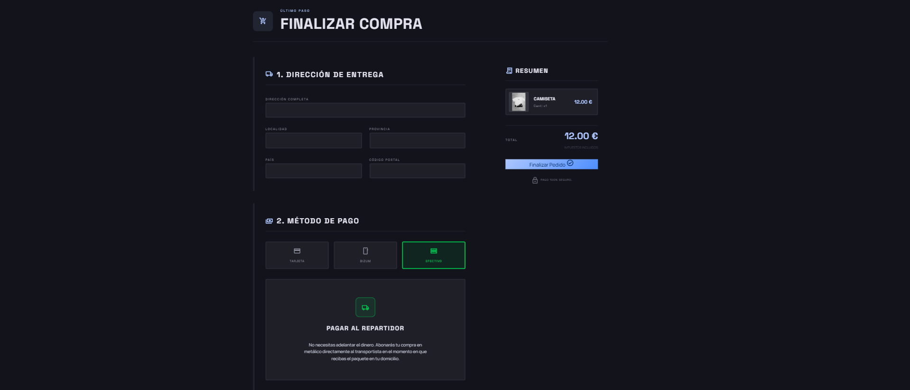

Si todo ha salido bien, te tiene que salir el siguiente mensaje:

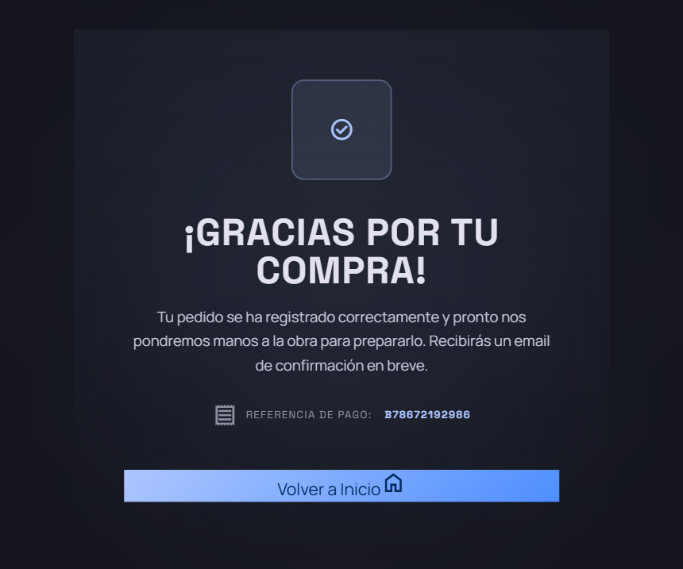


---

## 11. Instrucciones de Instalación Local

### Requisitos previos
- Docker y Docker Compose instalados
- Node.js 20+
- PHP 8.2+ y Composer

### Con Docker (recomendado)
```bash
git clone git@github.com:Iann5/TFG_DEF.git
cd TFG_DEF
docker-compose up --build
```
- Frontend: `http://localhost`
- Backend API: `http://localhost:8000/api`
- phpMyAdmin: `http://localhost:8080`

### Sin Docker (desarrollo)
```bash
# Backend
cd backend
composer install
php bin/console doctrine:database:create
php bin/console doctrine:migrations:migrate
symfony server:start

# Frontend (en otra terminal)
cd frontend
npm install
npm run dev
```

---
